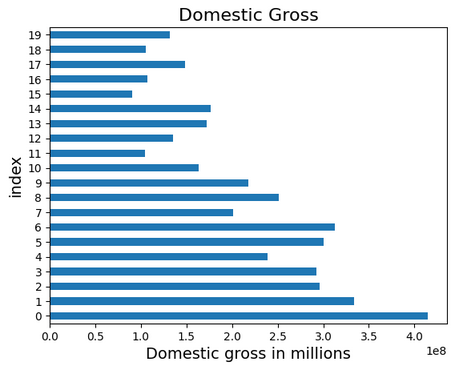
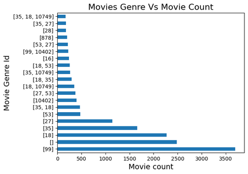

# Introduction

The movie industry is a very lucrative one. IMDB, Rotten Tommatoes, The Movie Database(TMDB) and BOM movies are some of the databases with the movies data. They contains a large number of public data on films such as the title of the film, the year of release of the film, the genre of the film, the audience, the rating of critics, the duration of the film, the summary of the film, actors, directors and much more. Faced with the large amount of data available on this sites. I will use them for this analysis.
# Project Overview
## Overview
The aim of this project is to help the new Microsoft movie department to get insights. They want to get into the movie industry as it is a very fast growing industry with other big companies having a share from it. This analysis will help them get a piece of the cake.
##Business Problem
Microsoft sees all the big companies creating original video content and they want to get in on the fun. They have decided to create a new movie studio, but they don’t know anything about creating movies. You are charged with exploring what types of films are currently doing the best at the box office. You must then translate those findings into actionable insights that the head of Microsoft's new movie studio can use to help decide what type of films to create.
## Aim of the project
The main aim of this project was/is to find the insights that are needed to know whether to start a new movie company/department by Microsoft. The movie industry started about a century ago and has grown massively over the years with new movie ideas coming up every single day. Microsoft has decided to join in in the fun. In order to accomplish this they need to know the major points to hit in order to get into the industry smoothly.
## Questions to answer
    The studio with the most movies
    What genres are most produced
    The language of the movie that is most popular
    How the year of production has affected it worldwide_gross

## Data Description

In this analysis i will be using the following data:

    * bom.movie_gross.csv
    * tmdb.movies.csv
    * tn.movie_budgets.csv
    * rt.movie_info.tsv
    * rt.reviews.tsv

The datasets are extracted from the following sites:

    * Box Office.
    * IMDB.
    * Rotten Tomatoes.
    * TheMovieDB.
    * The Numbers.

Data cleaning was done by dropping missing values and filling the usable missing values. Also done was the merging of tables to have more data to use while analyzing.
# Exploratory Data Analysis (EDA)

## Screenshots
### 1. The studio with the most movies.
#### img 1.

#### img 2.

### 2. What genres are most produced.
#### img 1.

#### img 2.

#### img 3.

### 3. The language of the movie that is most popular.
#### img 1.

### 4. How the year of production has affected it worldwide_gross.
#### img 1.

## Conclusion
    * The language that is most used while writing, creating and producing the movies
    * The studios with the most movies out and how they would help the new movie department
    * The genre with the most number of movies out
    * The release year and its effect on the gross income/profit
    * The average domestic gross of the movies.

## Recommendation
    * Microsoft should use English for most movies while also producing movies focused on the other native languages so as to increase their fan base. They can also include subtitles in the other native languages
    * While starting out, they could collaborate with the bigger already established companies in order to get their presence known quicker.
    * They should major on the production of the movie genres that have the highest number of movies out (Supply and demand).
    * They should not only focus on the most common genres because there is a wide range of likes from the fan base that would like to see other types of genres.
    * In this age and time of the internet they should most definitely get into the movie business.
